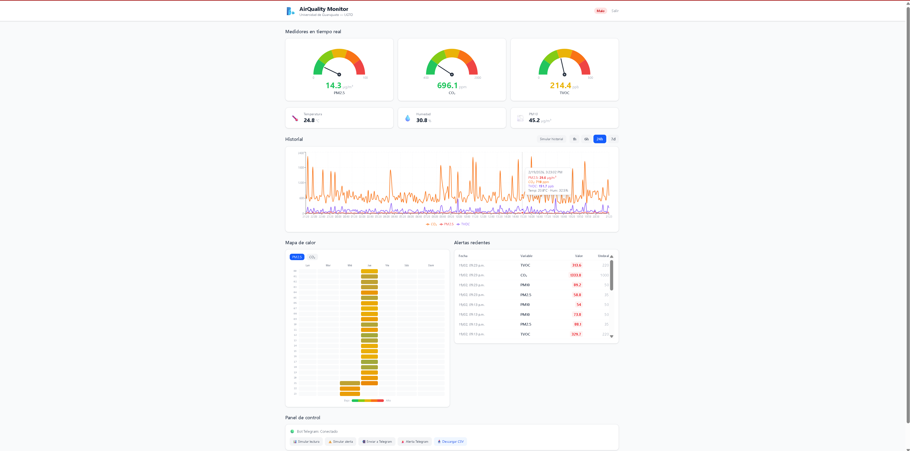
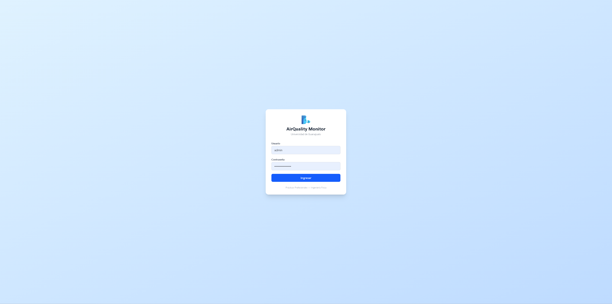
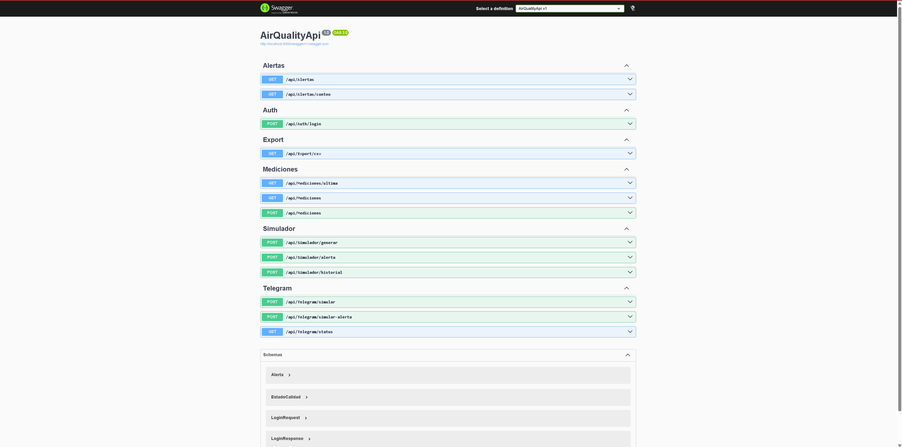
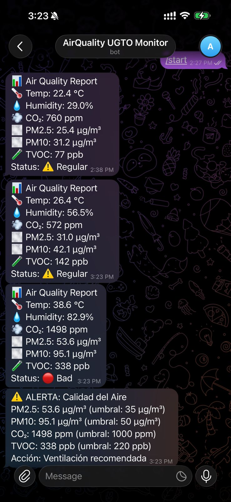

# 🌬️ AirQuality Monitor — Sistema de Monitoreo de Calidad del Aire


Sistema web completo para monitoreo en tiempo real de calidad del aire, desarrollado como proyecto de prácticas profesionales en la **Universidad de Guanajuato**. Incluye dashboard interactivo con medidores tipo velocímetro, gráficas de historial, mapa de calor, integración con Telegram, y API REST documentada con Swagger.

---

## 📸 Screenshots

| Dashboard | Login |
|---|---|
|  |  |

| Swagger API | Telegram Bot |
|---|---|
|  |  |

---

## ✨ Características Principales

- 🎛️ **Medidores tipo velocímetro** en tiempo real para PM2.5, CO₂ y TVOC con zonas de riesgo codificadas por color
- 📈 **Gráficas de historial** con selector de rango temporal (1h, 6h, 24h, 7 días)
- 🗓️ **Mapa de calor** hora × día de la semana para detectar patrones de contaminación
- 🚨 **Sistema de alertas** automático basado en umbrales de la OMS y EPA
- 📲 **Bot de Telegram** con envío y recepción de datos en tiempo real
- 📥 **Exportación a CSV** con filtro por rango de fechas
- 🔐 **Autenticación JWT** para proteger el acceso al dashboard
- 📖 **API REST** completamente documentada con Swagger UI
- 📊 **Simulador de datos** con distribución gaussiana para desarrollo y demos
- 📱 **Diseño responsive** optimizado para desktop, tablet y móvil

---

## 🏗️ Arquitectura

El sistema sigue una **arquitectura REST desacoplada** con patrón **productor-consumidor**. La fuente de datos es completamente intercambiable sin modificar el backend ni el frontend:

```
┌───────────────────────────────────────────────────────┐
│                  FUENTES DE DATOS                     │
│                                                       │
│  ┌─────────────┐  ┌──────────────┐  ┌─────────────┐  │
│  │ Simulador   │  │ Bot Telegram │  │ ESP32 Real  │  │
│  │ (Box-Muller)│  │ (Nuestro)    │  │ (Futuro)    │  │
│  └──────┬──────┘  └──────┬───────┘  └──────┬──────┘  │
└─────────┼────────────────┼─────────────────┼──────────┘
          │                │                 │
          └────────┬───────┴─────────────────┘
                   ▼
     ┌──────────────────────────┐
     │  ASP.NET Core 9 Web API  │
     │  POST /api/mediciones    │  ◄── Endpoint universal
     │  + AlertaService         │
     │  + SimuladorService      │
     │  + TelegramService       │
     │  + Swagger UI            │
     └────────────┬─────────────┘
                  │
             ┌────▼────┐
             │ SQLite  │
             └────┬────┘
                  │
     ┌────────────▼─────────────┐
     │   React + Vite + TW CSS  │
     │   • Gauges velocímetro   │
     │   • Gráficas Recharts    │
     │   • Mapa de calor        │
     │   • Panel de control     │
     └──────────────────────────┘
```

El endpoint `POST /api/mediciones` acepta datos de cualquier fuente. Esto permite desarrollar todo el sistema sin depender del hardware y luego conectar el ESP32 real sin cambiar una sola línea de código en el frontend.

---

## 🔧 Stack Tecnológico

| Componente | Tecnología | Versión |
|---|---|---|
| Backend API | C# + ASP.NET Core | 9.0 |
| ORM | Entity Framework Core | 9.0 |
| Base de datos | SQLite | 3 |
| Autenticación | JWT Bearer | — |
| Bot Telegram | Telegram.Bot | 22.9 |
| Frontend | React + Vite | 18 / 7 |
| Estilos | Tailwind CSS | 4 |
| Gráficas | Recharts | 2.x |
| Documentación API | Swagger / OpenAPI | — |

---

## 🚀 Cómo Ejecutar

### Prerrequisitos

- [.NET 9 SDK](https://dotnet.microsoft.com/download/dotnet/9.0)
- [Node.js 18+](https://nodejs.org/)
- [Git](https://git-scm.com/)

### 1. Clonar el repositorio

```bash
git clone https://github.com/tu-usuario/air-quality-monitor.git
cd air-quality-monitor
```

### 2. Backend

```bash
cd backend/AirQualityApi
dotnet run
```

El backend inicia en `http://localhost:5000`. Swagger UI disponible en `http://localhost:5000/swagger`.

### 3. Frontend

```bash
cd frontend
npm install
npm run dev
```

El frontend inicia en `http://localhost:5173`.

### 4. Ingresar al Dashboard

- **Usuario:** `admin`
- **Contraseña:** `AirQuality2026!`

### 5. Generar datos de prueba

Desde Swagger o el Panel de Control del dashboard:

```bash
# Generar 24 horas de historial (288 mediciones cada 5 min)
curl -X POST http://localhost:5000/api/simulador/historial?cantidad=288
```

---

## 📡 Endpoints de la API

### Públicos (sin autenticación)

| Método | Endpoint | Descripción |
|---|---|---|
| `POST` | `/api/auth/login` | Obtener JWT token |
| `POST` | `/api/simulador/generar` | Generar medición simulada |
| `POST` | `/api/simulador/alerta` | Generar medición con valores altos |
| `POST` | `/api/simulador/historial?cantidad=288` | Generar N mediciones históricas |
| `POST` | `/api/telegram/simular` | Enviar medición simulada al bot |
| `POST` | `/api/telegram/simular-alerta` | Enviar alerta simulada al bot |
| `GET` | `/api/telegram/status` | Estado del bot de Telegram |

### Protegidos (requieren JWT)

| Método | Endpoint | Descripción |
|---|---|---|
| `GET` | `/api/mediciones?horas=24` | Mediciones por rango de horas |
| `GET` | `/api/mediciones/ultima` | Última medición registrada |
| `POST` | `/api/mediciones` | Registrar nueva medición |
| `GET` | `/api/alertas?horas=24` | Alertas por rango de horas |
| `GET` | `/api/alertas/conteo` | Conteo de alertas por variable |
| `GET` | `/api/export/csv?desde=...&hasta=...` | Exportar mediciones a CSV |

---

## 📊 Simulador de Datos

El sistema incluye un simulador estadístico para desarrollo y demostraciones sin necesidad de hardware. Los datos se generan usando la **transformada de Box-Muller** para obtener distribuciones gaussianas con parámetros realistas basados en mediciones de proyectos ESP32 publicados en GitHub y papers académicos.

| Variable | Media | Desv. Estándar | Basado en |
|---|---|---|---|
| PM2.5 | 18.0 µg/m³ | 8.0 | Datos urbanos León, Gto. |
| PM10 | 30.0 µg/m³ | 12.0 | Datos urbanos León, Gto. |
| CO₂ | 620 ppm | 150 | Mediciones interiores típicas |
| TVOC | 90 ppb | 50 | Sensores SGP30/SGP41 |
| Temperatura | 25.0 °C | 4.0 | Clima León, Gto. |
| Humedad | 48.0 %RH | 12.0 | Clima León, Gto. |

Cada medición simulada tiene un **10% de probabilidad de generar un pico alto** que simula eventos reales como tráfico vehicular, actividad industrial o cocción de alimentos.

---

## 📲 Integración con Telegram

El sistema incluye un bot de Telegram con dos servicios:

1. **TelegramEmisorService** — Envía mediciones al bot con el formato estándar de un ESP32 real
2. **TelegramLectorService** — Lee mensajes del bot vía polling, parsea los datos y los almacena en la base de datos

**Flujo actual (simulación):**
```
Dashboard → API → Bot Telegram → API (polling) → Dashboard
```

**Flujo futuro (ESP32 real):**
```
ESP32 del Dr. Villaseñor → Bot Telegram → API (polling) → Dashboard
```

Para conectar el ESP32 real, solo se necesita actualizar `BotToken` y `ChatId` en `appsettings.json`. El parser ya está preparado para el formato estándar de mensajes de calidad del aire.

---

## 🔬 Variables Monitoreadas

| Variable | Unidad | Rango Normal | Umbral Alerta | Bueno | Regular | Malo |
|---|---|---|---|---|---|---|
| PM2.5 | µg/m³ | 0 – 35 | > 35 | ≤ 15 | ≤ 35 | > 35 |
| PM10 | µg/m³ | 0 – 50 | > 50 | — | — | — |
| CO₂ | ppm | 400 – 1000 | > 1000 | ≤ 900 | ≤ 1200 | > 1200 |
| TVOC | ppb | 0 – 220 | > 220 | ≤ 120 | ≤ 200 | > 200 |
| Temperatura | °C | 15 – 35 | > 40 | — | — | — |
| Humedad | %RH | 30 – 70 | > 80 | — | — | — |

La clasificación general se determina por la combinación de PM2.5, CO₂ y TVOC. Si **cualquiera** supera el umbral de "Malo", el estado general es **Malo**.

---

## 📁 Estructura del Proyecto

```
air-quality-monitor/
├── README.md
├── .gitignore
│
├── backend/
│   └── AirQualityApi/
│       ├── AirQualityApi.csproj
│       ├── Program.cs
│       ├── appsettings.json
│       ├── Models/
│       │   ├── Medicion.cs
│       │   ├── Alerta.cs
│       │   ├── EstadoCalidad.cs
│       │   ├── LoginRequest.cs
│       │   └── LoginResponse.cs
│       ├── Data/
│       │   └── AppDbContext.cs
│       ├── Services/
│       │   ├── AlertaService.cs
│       │   ├── SimuladorService.cs
│       │   ├── TelegramEmisorService.cs
│       │   └── TelegramLectorService.cs
│       └── Controllers/
│           ├── MedicionesController.cs
│           ├── AlertasController.cs
│           ├── SimuladorController.cs
│           ├── TelegramController.cs
│           ├── ExportController.cs
│           └── AuthController.cs
│
└── frontend/
    ├── package.json
    ├── vite.config.js
    ├── index.html
    └── src/
        ├── App.jsx
        ├── main.jsx
        ├── index.css
        ├── services/
        │   ├── api.js
        │   └── auth.js
        └── components/
            ├── Login.jsx
            ├── Dashboard.jsx
            ├── GaugeVelocimetro.jsx
            ├── GraficaHistorial.jsx
            ├── SelectorRango.jsx
            ├── MapaCalor.jsx
            ├── TablaAlertas.jsx
            └── PanelControl.jsx
```

---

## 👤 Autor

**Eduardo Ayala Tamayo**
Ingeniería Física — Universidad de Guanajuato (UGTO)
Prácticas Profesionales — Febrero 2026

**Asesor:** Dr. Carlos Villaseñor — Departamento de Ciencias de la Información (DCI)

---

## 📄 Licencia

Este proyecto está bajo la licencia MIT. Ver el archivo [LICENSE](LICENSE) para más detalles.
